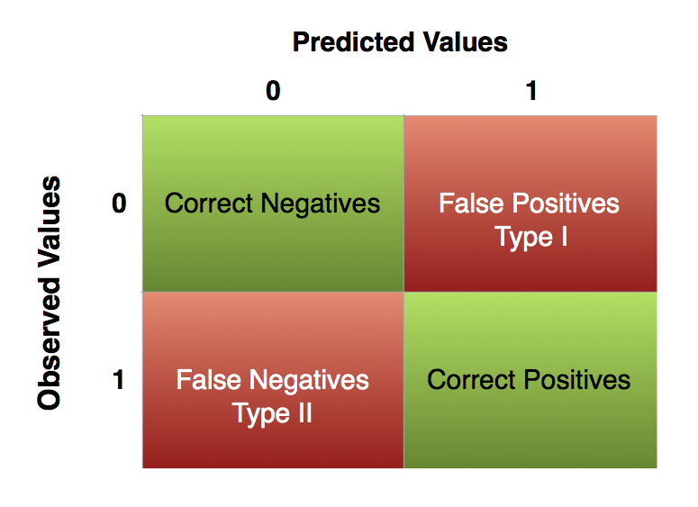

# Hands-on Tutorial

Let's start by loading the required packages:

```{r message = FALSE}
library(foreign) 
library(Zelig) 
library(texreg) 
library(lmtest)
library(dplyr)
```

Clear the environment

```{r}
rm(list = ls())
```

## Application to British Election Study Dataset

We use a subset of the 2005 face-to-face British post election study to explain turnout.

Disclaimer: We use a slightly modified version of the data set. For your own research please visit the [British Election Study website](http://www.britishelectionstudy.com) and download the original dataset.

You can download the dataset and codebook from the links below:

- **[Dataset](http://uclspp.github.io/PUBLG100/data/bes.dta)**
- **[Codebook](http://uclspp.github.io/PUBLG100/data/bes_codebook.txt)**

Most of the variable names in the dataset are self explanatory, but ones that need some clarification are listed below:

|Variable      |Description                           |Range|
|--------------|--------------------------------------|--------------------|
|Turnout       |Turnout at 2005 Brit election         |No (0); Yes (1)|
|Gender        |R's gender                            |1 (male); 0 (female)|
|LeftRightSelf |R's self placement on left-right      |1 (left) - 11 (right)|
|CivicDutyIndex|Sum of scores on CivicDuty1-7         |high values mean high civic duty|
|polinfoindex  |Correctly answered knowledge questions|0 (low) - 8 (high)|
|edu*          |yrs of education                      |binary|
|in.school     |R still in school                     |binary|
|in.uni        |R attends university                  |binary|

## Loading Data

```{r}
bes <- read.dta("bes.dta")
```

```{r echo = FALSE}
source("./R/knitr_hooks.R")
```

Let's convert the `Gender` variable to a factor to help us with the interpretation of the results.

```{r}
bes$Gender <- factor(bes$Gender, levels = c(0, 1), labels = c("Female", "Male"))
```

Now take a look at the first few observations to see what the dataset looks like

```{r}
head(bes)
```

We have a number of missing values. Let's remove them from the dataset but we want to make sure we only remove observations when the variables we are interested in are missing. We'll follow the same procedure we used in week 5 for removing NA's. 

While this method might seem tedious, it ensures that we're not dropping observations unnecessarily.

```{r}
bes <- filter(bes, 
              !is.na(Turnout), 
              !is.na(Income), 
              !is.na(polinfoindex), 
              !is.na(Gender), 
              !is.na(edu15), 
              !is.na(edu17), 
              !is.na(edu18), 
              !is.na(edu19plus), 
              !is.na(in_school), 
              !is.na(in_uni))
```

## Regression with a Binary Dependent Variable

We use the generalized linear model function `glm()` to estimate a logistic regression. The syntax is very similar to other regression functions we're already familiar with, for example `lm()` and `plm()`. The `glm()` function can be used to estimate many different models. We tell `glm()` that we've binary dependent variable and we want to use the cumulative logistic link function using the `family = binomial(link = "logit")` argument:

```{r}
model1 <- glm(Turnout ~ Income + polinfoindex + Gender + 
                edu15 + edu17 + edu18 + edu19plus + in_school + in_uni, 
              family = binomial(link = "logit"),
              data = bes)

screenreg(model1)
```

## Model Quality

To assess the predictive accuracy of our model we will check the percentage of cases that it correctly predicts. Let's look the turnout data first. According to the codebook, `0` means the person did not vote, and `1` means they voted.

```{r}
table(bes$Turnout) 
```

```{r echo = FALSE}
# THIS CODE IS HERE FOR DISPLAYING THE CONTENT ON THE COURSE WEBSITE. YOU DO NOT NEED TO WORRY ABOUT WHAT IT DOES
mean_round <- function(x, pct = 1) { sprintf("`%.2f%s`", mean(x)*pct, if_else(pct == 100, "%", "")) }
```

If we look at the mean of Turnout we will see that is `r mean_round(bes$Turnout)`. That means `r mean_round(bes$Turnout, 100)` of the respondents said that they turned out to vote. If you predict for every respondent that they voted, you will be right for `r mean_round(bes$Turnout, 100)` of the people. That is the naive guess and the benchmark for our model. If we predict more than `r mean_round(bes$Turnout, 100)` of cases correctly our model adds value.

Below we will estimate predicted probabilities for each observation. That is, the probability our model assigns that a respondent will turn out to vote for every person in our data. To do so we use the `predict()` function with the following the usage syntax:

```
predict(model, type = "response")
```
Type `help(predict.glm)` for information on all arguments. 

```{r}
predicted_probs <- predict(model1, type = "response")
```

Now that we have assigned probabilities to people turning out to vote, we have to translate those into outcomes. Turnout is binary. A straightforward way would be to say: we predict that all people with a predicted probability above `50%` vote and all with predicted probabilities below or equal to `50%` abstain. 

Using the `50%` threshold, we create a new variable `expected_values` that is `1` if our predicted probability is larger than `0.5` and `0` otherwise. 

```{r}
expected <- as.numeric(predicted_probs > 0.5)
```

NOTE: The condition `predicted_probs > 0.5` gives us `FASLE/TRUE`, but since our dataset uses `0/1` for the `Turnout` variable, we convert it to a numeric value using `as.numeric()` function.

All we have to do now is to compare our expected values of turnout against the actually observed values of turnout. We want our predictions to coincide with the actually observed outcomes. But we need to be aware of two types of errors we can make: 

|| |
|-------------------------------------|--------------------------------|
|- A type I error is a false positive. It is like crying wolf when there is nothing there (we mistakenly reject a true null hypothesis). <br><br>- A type II error is a false negative. It is like not noticing the wolf and finding all your sheep dead the next morning (we fail to reject a false null hypothesis).||

The threshold that we set is directly related to the proportion of type I to type II errors. Increasing the threshold will reduce the number of false positives but increase the number of false negatives and vice versa. The default choice is a threshold of `0.5`. However, you may imagine situations where one type of error is more costly than the other. For example, given the cost of civil wars, a model predicting civil war may focus on reducing false negatives at the cost of a larger fraction of false positives.

We proceed by producing a table of predictions against actual outcomes. With that we will calculate the percentage of correctly predicted cases and compare that to the naive guess. We have the actually observed cases in our dependent variable (`Turnout`). The table is just a frequency table. The percentage of correctly predicted cases is simply the sum of correctly predicted cases over the number of cases. 

```{r}
observed <- bes$Turnout

outcome <- table(observed,expected)
outcome
```

Now let's find out how many we correctly predicted and how many we got wrong. You can manually add the numbers if you want, but it's simple enough to take the values out of the 2x2 table:

- Correct negatives are in row `1`, column `1`
- Correct positives are in row `2`, column `2`
- All others are incorrect

```{r}
(outcome[1,1] + outcome[2,2]) / sum(outcome)
```

Now let's remember what the actual turnout was:

```{r}
table(bes$Turnout)
```

In order to calculate the naive guess, we simply divide the mode by the total number of observations

```{r}
3082 / (1079 + 3082)
```

You can see that our model outperforms the naive guess slightly. The more lopsided the distribution of your binary dependent variable, the harder it is to build a successful model.

### Joint hypothesis testing

We will add two more explanatory variables to our model: `Influence` and `Age`. `Influence` corresponds to a theory we want to test while `Age` is a socio-economic control variable.

We want to test two theories: the rational voter model and the resource theory.

- Influence operationalises a part of the rational voter theory. In that theory citizens are more likely to turnout the more they belive that their vote matters. The variable `Influence` measures the subjective feeling of being able to influence politics.

- The variables `Income` and `polinfoindex` correspond to a second theory which states that people who have more cognitive and material resources are more likely to participate in politics. 

Depending on whether the coefficients corresponding to the respective theories are significant or not, we can say something about whether these theories help to explain turnout.

The remaining variables for gender, education and the added variable `Age` are socio-economic controls. We added age because previous research has shown that political participation changes with the life cycle. 

```{r}
model2 <- glm(Turnout ~ Income + polinfoindex + Influence + Gender + Age + 
                edu15 + edu17 + edu18 + edu19plus + in_school + in_uni, 
              family = binomial(link = "logit"), data = bes)

screenreg(list(model1, model2))
```

The variables corresponding to the resource theory are `Income` and `polinfoindex`. In our model 2 (the one we interpret), both more income and more interest in politics are related to a higher probability to turn out to vote. That is in line with the theory. Interestingly, income was previously insignificant in model 1. It is quite likely that model 1 suffered from omitted variable bias. 

As the rational voter model predicts, a higher subjective probability to cast a decisive vote, which we crudly proxy by the feeling to be able to influence politics, does correspond to a higher probability to vote as indicated by the positive significant effect of our `Influence` variable.

We will test if model 2 does better at predicting turnout than model 1. We use the likelihood ratio test. This is warranted because we added two variables and corresponds to the F-test in the OLS models estimated before. You can see values for the logged likelihood in the regression table. You cannot in general say whether a value for the likelihood is small or large but you can use it to compare models that are based on the same sample. A larger log-likelihood is better. Looking at the regression table we see that the log-likelihood is larger in model 2 than in model 1. 

We use the `lrtest()` function from the `lmtest` package to test whether that difference is statistically significant. The syntax is the following:

```{r}
lrtest(model1, model2)
```

The p-value in the likelihood ratio test is smaller than `0.05`. Therefore, the difference between the two log-likelihoods is statistically significant which means that model 2 is better at explaining turnout.

Now let's see if AIC and BIC agree.

```{r}
AIC(model1, model2)

BIC(model1, model2) 
```

According to both AIC and BIC, model 2 has a better fit.

## Interpretation with Zelig

Since we cannot directly estimate the marginal effects of the independent variables from a logistic regression model, we use `Zelig` to help us with the interpretation. We pick meaningful scenarios and predict the probability that a person will vote based on the scenarios. What are meaningful scenarios? A meaningful scenario is a set of covariate values that corresponds to some case that is interesting in reality. For example, you may want to compare a women with 18 years of education to a man with 18 years of education while keeping all other variables at their means, medians or modes.

First, we re-estimate our previous model using `Zelig`. 

NOTE: Since we're estimating a logistic regression model, we use `model = "logit"` instead of `model = "ls"` like we've done in the past.

```{r}
z.out <- zelig(Turnout ~ Income + polinfoindex + Influence + Gender + Age + 
                 edu15 + edu17 + edu18 + edu19plus + in_school + in_uni, 
               model = "logit", 
               data = bes)
```

In order to compare the average women with 18 years of education to the average man with 18 years of education, `Gender` to either `Male` or `Female`, `edu18` to `1` and all other binary variables to their modes, ordinally scaled variables to their medians and interval scaled variables to their means.

```{r echo = FALSE}
set.seed(666)
```

```{r}
x.male <- setx(z.out, 
               Gender = "Male", edu18 = 1, 
               Age = mean(bes$Age),
               Income = mean(bes$Income), 
               polinfoindex = mean(bes$polinfoindex), 
               Influence = mean(bes$Influence),  
               edu15 = 0, edu17 = 0, edu19plus = 0, in_school = 0, in_uni = 0)

x.female <- setx(z.out, Gender = "Female", edu18 = 1, 
                 Age = mean(bes$Age),
                 Income = mean(bes$Income), 
                 polinfoindex = mean(bes$polinfoindex), 
                 Influence = mean(bes$Influence),  
                 edu15 = 0, edu17 = 0, edu19plus = 0, in_school = 0, in_uni = 0)

s.out <- sim(z.out, x.male, x1 = x.female)
summary(s.out)
```

```{r echo = FALSE} 
# IGNORE THESE FUNCTIONS. They are used for generating course website
get_sim_out <- function(x, i, j) {
  sprintf("`%d%%`", round(mean(x$sim.out[[i]][[j]][[1]])*100))
}

get_margin_of_error <- function(x, i, j, s = "") {
  qi <- x$sim.out[[i]][[j]][[1]][,1]
  quantiles <- quantile(qi, c(0.025, 0.975))
  sprintf("`%d%s`", round(((quantiles[2] - quantiles[1])/2)*100), s)
}

get_ci_low <- function(x, i, j) {
  qi <- x$sim.out[[i]][[j]][[1]][,1]
  quantiles <- quantile(qi, c(0.025, 0.975))
  sprintf("`%d`", round(min(quantiles)*100))
}

get_ci_high <- function(x, i, j) {
  qi <- x$sim.out[[i]][[j]][[1]][,1]
  quantiles <- quantile(qi, c(0.025, 0.975))
  sprintf("`%d`", round(max(quantiles)*100))
}
```

If you're not familiar with how to interpret Zelig simulation summary, then click at the link below for an annotated example:

<a href="https://uclspp.github.io/PUBLG100/faq/zelig_sim.html" type="button" class="btn btn-info">Interpreting Zelig Simulation</a>

For the average woman (in our sample) with `18` years of education, we predict a probability of `r get_sim_out(s.out, "x1", "ev")` that she will vote. Our uncertainty is plus and minus `r get_margin_of_error(s.out, "x1", "ev", "%")` on the `95%` confidence level. Note that we've rounded up the numbers just to simplify the interpretation.

For her male counterpart, we predict the probability of turnout to be `r get_sim_out(s.out, "x", "ev")` (plus and minus `r get_margin_of_error(s.out, "x", "ev", "%")` based on the `95%` confidence interval). Is the difference between them statistically significant or put differently is our hypothetical woman more likely to vote than our hypothetical man?

To check that we look at the first difference. The difference is `r get_sim_out(s.out, "x1", "fd")` percentage points on average and between `r get_ci_low(s.out, "x1", "fd")` percentage points and `r get_ci_high(s.out, "x1", "fd")` percentage points based on the `95%` confidence interval.

Our next step will be to compare two groups like men and women while varying another continuous variable from lowest to highest. We use income here. So, we set a sequence for income, vary gender and keep every other variable constant at its appropriate measure of central tendency. 

Let's see what the range of `Income` variable is:

```{r}
range(bes$Income)
```

`Income` ranges from ``r min(bes$Income)`` to ``r max(bes$Income)`` in our sample so we can just say ``r sprintf("Income = %d:%d", min(bes$Income), max(bes$Income))`` or use the `seq()` function as shown below:

```{r echo = FALSE}
set.seed(666)
```

```{r}
x.male <- setx(z.out, 
               Gender = "Male", edu18 = 1, 
               Age = mean(bes$Age),
               Income = seq(1, 13), 
               polinfoindex = mean(bes$polinfoindex), 
               Influence = mean(bes$Influence),  
               edu15 = 0, edu17 = 0, edu19plus = 0, in_school = 0, in_uni = 0)

x.female <- setx(z.out, Gender = "Female", edu18 = 1, 
                 Age = mean(bes$Age),
                 Income = seq(1, 13), 
                 polinfoindex = mean(bes$polinfoindex), 
                 Influence = mean(bes$Influence),  
                 edu15 = 0, edu17 = 0, edu19plus = 0, in_school = 0, in_uni = 0)

s.out <- sim(z.out, x.male, x1 = x.female)
```

Now we can plot the confidence interval for the two groups:

```{r}
ci.plot(s.out, 
        ci = 95,
        xlab = "Income", 
        ylab = "Predicted Probability of Voting",
        main = "Effect of Income by Gender")

# add labels manually
# NOTE: the x and y values below are just coordinates on the plot, you can change 
#       them based on where you want the labels placed
text(x = 3, y = .85, labels = "Women")  
text(x = 6, y = .75, labels = "Men")    
```

